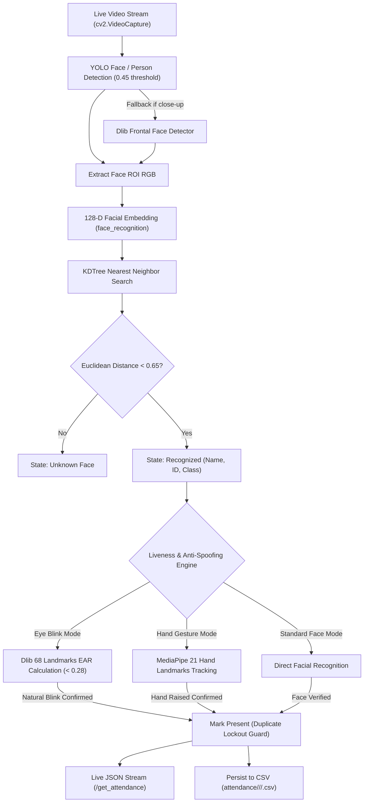

# 📊 RATS: Project Architecture & System Overview

**Project Name:** Real-Time Attendance Tracking System (RATS)  
**Core Technologies:** Python 3.11, Flask, Ultralytics YOLO (v8 & v5), Dlib 68-Landmarks, MediaPipe, Face Recognition, KD-Tree, Werkzeug Security  

---

## 🎯 1. Executive Summary

**RATS (Real-Time Attendance Tracking System)** is an enterprise-grade automated computer vision platform designed for smart educational institutions. It completely replaces manual roll calls, paper sheets, and proxy attendance by:
- Recognizing registered students in real-time from high-definition video streams.
- Performing active **anti-spoofing liveness verification** (facial eye blinks or hand gestures) to block photos and looped videos.
- Automatically cataloging institutional classes, teacher class assignments, and substitute/proxy instructor sessions.
- Securing accounts with cryptographic password hashes and role-based access control (RBAC).

---

## 📁 2. File & Directory Structure

```
YOLOv5-v8_RealTime_Attendance_Tracking_system/
├── app.py                      # Unified Enterprise Server (All 6 AI engines + Web Portal) [Port 5001]
├── run_mac.sh                  # Interactive macOS terminal launcher
│
├── shape_predictor_68_face_landmarks.dat  # Dlib 68-point facial landmark predictor (~99MB)
│
├── yolov8/                     # YOLOv8 neural network weights (yolov8n.pt, yolov8l.pt)
├── yolov5/                     # YOLOv5 neural network weights (yolov5s.pt, yolov5su.pt)
│
├── classes.csv                 # Institutional class catalog (class_code, class_name, department)
├── users.csv                   # User database (username, password_hash, assigned_classes, role)
├── known_faces.csv             # Enrolled student database (image_path, name, id, class_name, email)
├── photos/                     # Gallery of registered student portrait images
├── attendance/                 # Generated session logs (attendance/<instructor>/<class>/<date>/)
│
├── templates/                  # Jinja2 Frontend Templates
│   ├── login.html              # Secure instructor / administrator login
│   ├── home.html               # Teacher dashboard & quick-launch assigned classes
│   ├── register_student.html   # Student webcam enrollment & directory management
│   ├── take_attendance.html    # Live multi-model AI camera stream & real-time attendance feed
│   └── see_attendance.html     # Historical attendance analytics, PDF export, & substitute discovery
│
├── static/                     # Assets & illustrations (login.png, home.png)
├── legacy/                     # Standalone legacy scripts (Yolov8Eye.py, Yolov5Hand.py, etc.)
│
├── requirements.txt            # Python dependencies manifest
├── MAC_SETUP_AND_REQUIREMENTS.md  # Detailed macOS installation guide
├── PROJECT_OVERVIEW.md         # Full architecture specification document
└── README.md                   # Quick-start documentation
```

---

## ⚙️ 3. Computer Vision & Anti-Spoofing Pipeline



### 1. High-Performance Face Matching (`KDTree`)
- When student faces are registered via the `/register_student` portal, their 128-dimensional embedding vectors are generated and indexed into an in-memory **$k$-d tree (`sklearn.neighbors.KDTree`)**.
- During live camera processing, face vectors query the tree in $\mathcal{O}(\log N)$ time, achieving real-time 30 FPS inference.

### 2. Dual-Engine Anti-Spoofing Liveness
- **Eye Aspect Ratio (EAR)**: Computes the vertical vs. horizontal distance across eye landmark points $p_1 \dots p_6$:
  $$\text{EAR} = \frac{\|p_2 - p_6\| + \|p_3 - p_5\|}{2 \cdot \|p_1 - p_4\|}$$
  When EAR drops below `0.28` for 1–5 frames followed by an open state, a genuine human blink is confirmed.
- **MediaPipe Hand Gesture**: Evaluates 21 landmark coordinate positions in 3D space (`mp.solutions.hands`) to verify active student participation.

---

## 🔒 4. Enterprise Security & Relational Architecture

1. **Cryptographic Salted Password Hashing**:
   - All passwords in `users.csv` are hashed using `werkzeug.security` (`scrypt:32768:8:1` / `pbkdf2:sha256`) with automatic upgrade protection.
2. **Session Security & Ephemeral Tokens**:
   - A 32-byte cryptographic token is generated and persisted in `.secret_key` (git-ignored) for tamper-proof session cookies.
3. **Role-Based Access Control (RBAC)**:
   - **Administrators (`admin`)**: Authorized to delete student profiles and manage all institutional classes.
   - **Lead Instructors & Faculty (`tirth`, `teacher`)**: Authorized to take attendance for assigned and substitute classes; student deletion is locked.
4. **Substitute / Proxy Instructor Management**:
   - Teachers covering for colleagues can select any institutional class or create custom class sections on the fly with automatic `[Substitute Session]` audit tagging.
5. **Cross-Instructor Attendance Discovery (`find_attendance_files`)**:
   - Class attendance records taken by substitute teachers are automatically indexed and searchable by regular teachers and school administrators.
