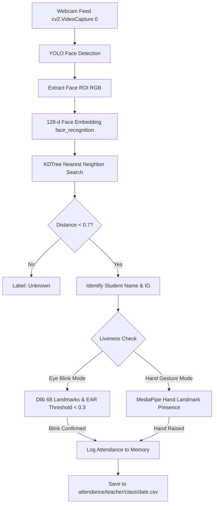

# 📊 RATS: Project Architecture & System Overview

**Project Name:** Real-Time Attendance Tracking System (RATS)  
**Core Technologies:** Flask, Ultralytics YOLO (v5 & v8), Dlib, MediaPipe, Face Recognition, KD-Tree  

---

## 🎯 1. Executive Summary

**RATS (Real-Time Attendance Tracking System)** is an automated computer vision application designed for smart classrooms. It eliminates manual roll calls and buddy-punching by recognizing enrolled students from live webcam video streams, verifying human liveness (eye blinks or hand gestures), and automatically logging attendance to structured CSV files.

---

## 📁 2. File & Directory Breakdown

```
RATS_YOLO_ALL/
├── Yolov8Eye.py            # Main App: YOLOv8 + Dlib Eye Blink Liveness (Port 5003)
├── Yolov8Hand.py           # Main App: YOLOv8 + MediaPipe Hand Gesture Liveness (Port 5000)
├── Yolov8Login.py          # Main App: YOLOv8 Face Detection Attendance (Port 5000)
├── Yolov5Eye.py            # YOLOv5 + Dlib Eye Blink Liveness (Port 5001)
├── Yolov5Hand.py           # YOLOv5 + MediaPipe Hand Gesture Liveness (Port 5000)
├── Yolov5Login.py          # YOLOv5 Face Detection Attendance (Port 5000)
│
├── shape_predictor_68_face_landmarks.dat  # Dlib 68-point landmark predictor (~99MB)
│
├── yolov8/                 # Pretrained YOLOv8 weights (yolov8n.pt, yolov8l.pt)
├── yolov5/                 # Pretrained YOLOv5 weights (yolov5s.pt, yolov5su.pt)
│
├── users.csv               # Teacher login credentials database
├── known_faces.csv         # Enrolled student database index
├── photos/                 # Registered student face image gallery
├── attendance/             # Daily generated CSV attendance records
│
├── templates/              # Flask Jinja2 UI templates (login, home, take_attendance, see_attendance)
├── static/                 # Static illustrations & assets (login.png, home.png)
│
├── requirements.txt        # Python package dependency manifest
├── MAC_SETUP_AND_REQUIREMENTS.txt # Plain text Mac setup guide
├── MAC_SETUP_AND_REQUIREMENTS.md  # Markdown Mac setup guide
├── PROJECT_OVERVIEW.txt    # Plain text project overview
└── PROJECT_OVERVIEW.md     # Markdown project overview
```

---

## ⚙️ 3. How the Computer Vision Pipeline Works



### 1. Face Recognition & KDTree Matching
* On application startup, all images from `photos/` are converted into 128-dimensional floating point vectors via `face_recognition`.
* A **KD-Tree (`sklearn.neighbors.KDTree`)** is constructed from all face vectors.
* During live streaming, incoming face vectors query the KD-Tree in `O(log N)` time for instant real-time identification.

### 2. Liveness & Anti-Spoofing
* **Eye Aspect Ratio (EAR)**: Using Dlib's 68 facial points, points 36-41 (left eye) and 42-47 (right eye) calculate EAR:
  $$\text{EAR} = \frac{\|p_2 - p_6\| + \|p_3 - p_5\|}{2 \cdot \|p_1 - p_4\|}$$
  When EAR drops below `0.3` across consecutive frames, a natural blink is confirmed.
* **Hand Gesture**: MediaPipe detects 21 hand landmarks (`mp.solutions.hands`) to verify student participation before marking attendance.

---

## 🖥️ 4. Web Interface & Workflows

1. **Authentication ([templates/login.html](file:///Users/tirth/Downloads/my%20project/RATS_YOLO_ALL/templates/login.html))**:
   - Teachers log in using credentials verified against [users.csv](file:///Users/tirth/Downloads/my%20project/RATS_YOLO_ALL/users.csv).
2. **Dashboard ([templates/home.html](file:///Users/tirth/Downloads/my%20project/RATS_YOLO_ALL/templates/home.html))**:
   - Navigation options to either start an attendance session or inspect past attendance logs.
3. **Take Attendance ([templates/take_attendance.html](file:///Users/tirth/Downloads/my%20project/RATS_YOLO_ALL/templates/take_attendance.html))**:
   - Live multipart JPEG stream (`/video_feed`).
   - Dynamic real-time table populated as students are verified.
   - Saves final records with timestamps to `attendance/<teacher>/<class>/<date>/`.
4. **See Attendance ([templates/see_attendance.html](file:///Users/tirth/Downloads/my%20project/RATS_YOLO_ALL/templates/see_attendance.html))**:
   - Historical attendance viewer allowing teachers to filter by class name and date.
