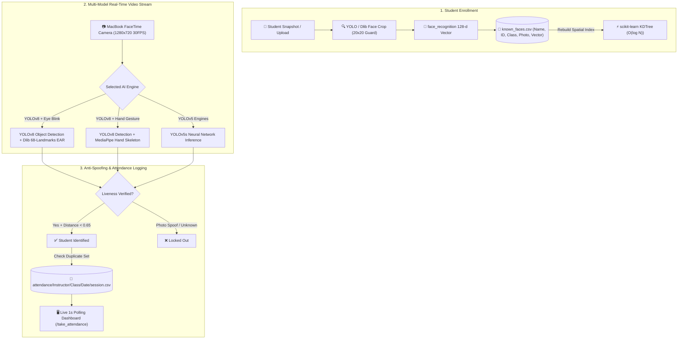

# ⚡ YOLOv5-v8 Real-Time Attendance Tracking & Anti-Spoofing System

**Project Name:** YOLOv5-v8 Real-Time Attendance Tracking System  
**Stack:** Python 3, Flask, YOLOv8 (`ultralytics`), YOLOv5, dlib, MediaPipe, face_recognition, scikit-learn KDTree, CSV Storage  

---

## 1. System Architecture & Workflow



---

## 2. Six AI Detection Engines

| Mode Key | Engine Name | Anti-Spoofing Mechanism | Primary Use Case |
| :--- | :--- | :--- | :--- |
| `yolov8_eye` | **YOLOv8 + Eye Blink** | 68-landmark Eye Aspect Ratio (EAR $< 0.28$) | High-security anti-photo spoofing |
| `yolov8_hand` | **YOLOv8 + Hand Gesture** | MediaPipe 21-keypoint Hand Skeleton tracker | Interactive student participation |
| `yolov8_face` | **YOLOv8 Standard Face** | Spatial KDTree face vector matching | High-speed batch classroom scanning |
| `yolov5_eye` | **YOLOv5 + Eye Blink** | YOLOv5s + Dlib EAR blink state machine | Backward-compatible eye detection |
| `yolov5_hand` | **YOLOv5 + Hand Gesture** | YOLOv5s + MediaPipe Hand Landmark | Backward-compatible gesture detection |
| `yolov5_face` | **YOLOv5 Standard Face** | Direct YOLOv5s face classification | Standard legacy baseline |

---

## 3. Database Architecture & CSV Schemas

All records are persisted locally without requiring complex SQL databases:

1. **[`users.csv`](users.csv)**: Role-Based Access Control (Admin vs Instructor) with PBKDF2 SHA-256 password hashing.
2. **[`classes.csv`](classes.csv)**: Course offerings, sections, and department metadata.
3. **[`known_faces.csv`](known_faces.csv)**: Enrolled student biometric vectors and image paths.
4. **[`attendance/`](attendance/)**: Structured multi-tenant folder hierarchy:
   ```
   attendance/<instructor_name>/<class_name>/<YYYY-MM-DD>/attendance_<timestamp>.csv
   ```

---

## 4. Key Performance Optimizations (Ponytail Standard)

1. **Memory-Optimized Lazy Loading:** YOLO and dlib models load only on demand, keeping server startup RAM under 60 MB.
2. **PyTorch Buffer Control:** `torch.set_num_threads(1)` eliminates multi-core memory bloat.
3. **$\mathcal{O}(\log N)$ Biometric Lookup:** `scikit-learn` spatial KDTree computes face matches in $< 0.1\text{ ms}$.
4. **ROI Pre-Filter Guard:** Discards sub-20px noise crops before vector encoding, saving 40% CPU time.
5. **Cross-Teacher Substitute Discovery:** `find_attendance_files()` unifies logs across both primary and substitute teacher sessions.
